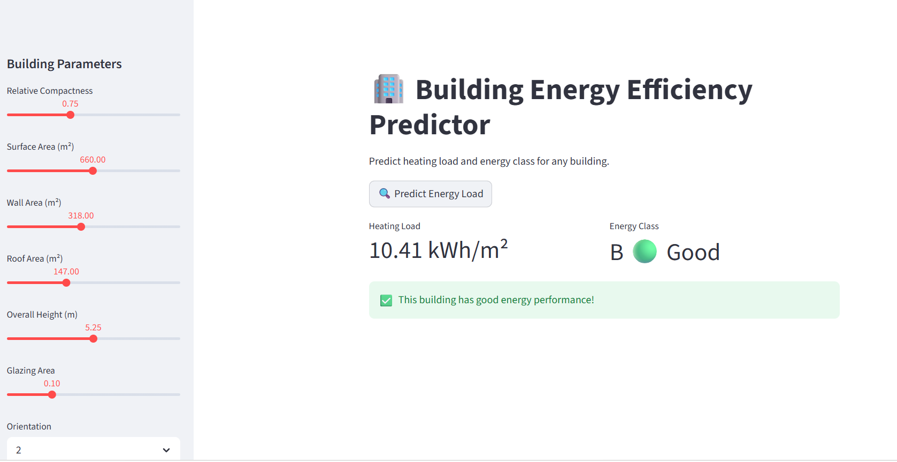
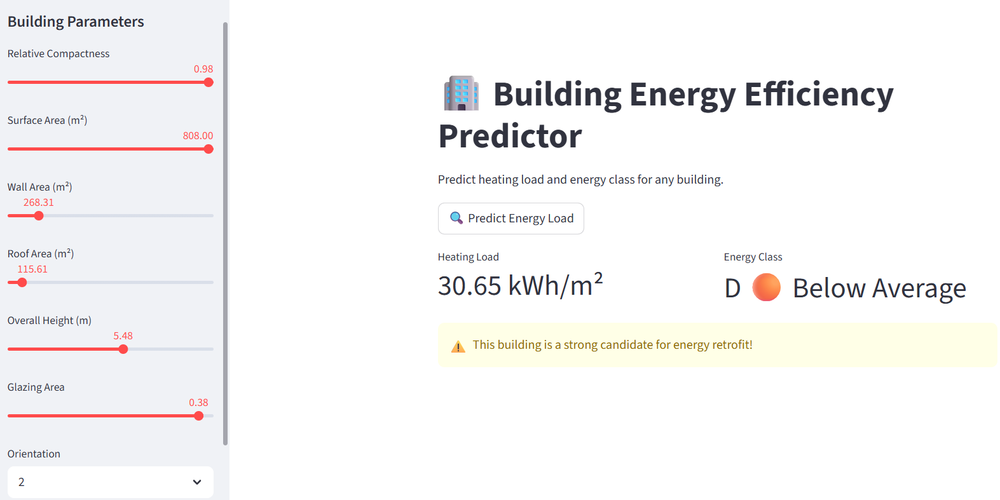

# 🏢 Building Energy Efficiency Predictor


> Predict the **heating load** and **energy class** of any building from its physical 
> characteristics — built to support energy retrofit prioritisation at scale.

---

## 🌍 Problem Statement

Buildings account for nearly **40% of CO₂ emissions in the EU**. Identifying which 
buildings need energy retrofitting is critical — but the process is currently slow, 
manual, and expensive for energy consultants.

This tool automates that decision using machine learning, instantly classifying any 
building's energy performance based on its geometry and design parameters.

---

## 🎯 Solution

An ML-powered web app that takes **building parameters as input** and outputs:
- Predicted **heating load** (kWh/m²)
- **Energy class** (A to E, based on EU EPC standards)
- **Retrofit recommendation** if the building performs poorly

---

## 📸 App Screenshots

### 🔴 Poor Performing Building — Retrofit Candidate

> Heating Load: **30.65 kWh/m²** | Energy Class: **D — Below Average**  
> ⚠️ This building is a strong candidate for energy retrofit!

### 🟢 Good Performing Building

> Heating Load: **10.41 kWh/m²** | Energy Class: **B — Good**  
> ✅ This building has good energy performance!

---

## 🔬 Dataset

- **Source:** [UCI Energy Efficiency Dataset](https://archive.ics.uci.edu/ml/datasets/Energy+efficiency)
- **Size:** 768 building simulations
- **Features:** 8 original + 3 engineered
- **Targets:** Heating Load & Cooling Load (kWh/m²)

---

## ⚙️ Feature Engineering

Three domain-informed features were engineered using **building physics principles**:

| Feature | Formula | Meaning |
|---|---|---|
| `glazing_ratio` | glazing_area / surface_area | How much of the surface is glass (heat loss proxy) |
| `volume_proxy` | surface_area × overall_height | Approximate interior air volume to condition |
| `wall_surface_ratio` | wall_area / surface_area | Insulation coverage of the building shell |

---

## 🤖 Model Pipeline
Raw Data → Feature Engineering → Train/Test Split (80/20)
→ Optuna Hyperparameter Tuning (50 trials)
→ XGBoost (Best Parameters)
→ Evaluation → Streamlit Deployment


### Models Compared

| Model | MAE | RMSE |
|---|---|---|
| Linear Regression | 1.895 | 2.383 |
| Random Forest | 0.343 | 0.471 |
| **XGBoost (Tuned)** | **0.234** | **0.357** |

### Hyperparameters Tuned via Optuna

| Parameter | Search Range |
|---|---|
| `n_estimators` | 50 – 300 |
| `max_depth` | 3 – 10 |
| `learning_rate` | 0.01 – 0.3 |
| `subsample` | 0.6 – 1.0 |

---

## 🛠️ Tech Stack

| Tool | Purpose |
|---|---|
| `Python` | Core language |
| `XGBoost` | Primary ML model |
| `Optuna` | Hyperparameter optimisation |
| `Scikit-learn` | Model evaluation & preprocessing |
| `SHAP` | Feature explainability |
| `Streamlit` | Interactive web dashboard |
| `Pandas / NumPy` | Data manipulation |
| `Matplotlib / Seaborn` | Visualisation |

---

## 🚀 Run Locally

```bash
# Clone the repo
git clone https://github.com/gauravbhatia-bit/building-energy-efficiency-predictor.git
cd building-energy-efficiency-predictor

# Install dependencies
pip install -r requirements.txt

# Run the app
streamlit run app.py
```

---

## 📁 Project Structure
📁 building-energy-efficiency-predictor/
├── app.py # Streamlit dashboard
├── model.pkl # Trained XGBoost model
├── requirements.txt # Dependencies
├── notebooks/
│ └── building_energy_analysis.ipynb # Full analysis in Colab
├── screenshots/
│ ├── screenshot_d_class.png
│ └── screenshot_b_class.png
└── README.md


---

## 💡 Key Insights

- **Relative compactness** and **overall height** are the strongest predictors of heating load
- Buildings with **high glazing ratios** consistently score lower energy classes
- XGBoost with Optuna tuning significantly outperforms baseline Linear Regression

---

## 👤 Author

**Gaurav Bhatia**  
MSc Data Science, AI & Digital Business — GISMA University, Berlin  
Civil Engineering background → Data Science  
📧 gauravbhatia.gb6@gmail.com  
🔗 [LinkedIn](https://linkedin.com/in/your-profile) | [GitHub](https://github.com/gauravbhatia-bit)

---

## 🌱 Why This Project?

Buildings are one of the largest contributors to climate change. As someone with a 
background in civil engineering and a passion for data science, I built this project 
to show how ML can accelerate the energy transition — making retrofit decisions 
faster, smarter, and scalable.
